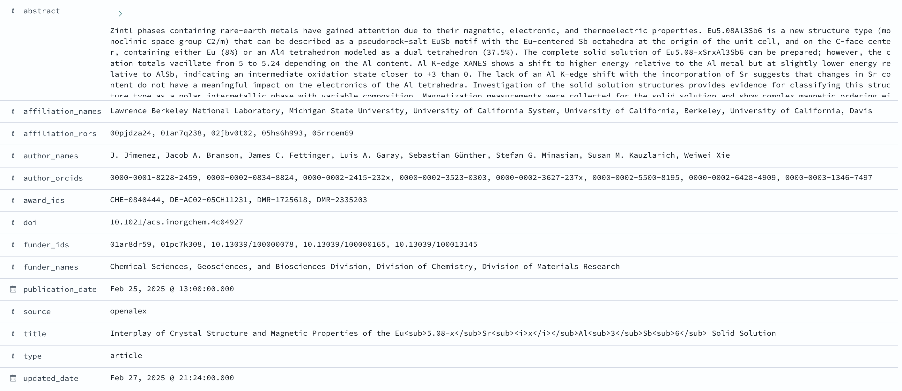

# DMP Related Works Demo

## Setup
Source environment variables:
```bash
source .env.demo
```

Create a demo version of the source datasets with works from UC Berkley:
```bash
./bin/demo_dataset.sh
```

## Cleaning and Transformation to Parquet
Raw datasets are first cleaned and normalised. Crossref Metadata, DataCite and
OpenAlex Works are separated into individual tables for works, authors, 
affiliations, funders and relations.

Transformations are performed using [Polars](https://pola.rs), a fast,
multi-threaded DataFrame library. Polars provides a consistent transformation
syntax and supports high-performance custom transformations written in Rust.

Identifiers are extracted from OpenAlex Funders and ROR to support SQL Mesh 
transformations that unify various identifier types (e.g. GRID, ISNI) into ROR 
and Crossref Funder Ids.

The processed data is stored into Parquet format, which 
is optimised for columnar databases such as DuckDB.

Common transformation steps include:
* Removing HTML markup from titles and abstracts; convert empty strings to null.
* Standardising date formats.
* Normalising identifiers, for example, by stripping URL prefixes.

DataCite specific transformations:
* Fixing inconsistencies in `affiliation` and `nameIdentifiers` schemas, which
can be lists or a single object.
* Extracting ORCID IDs from `nameIdentifiers`.

OpenAlex Works:
* Un-invert inverted abstract, e.g. `{"Hello":[0],"World":[1]}` to `Hello World`.

Create output directories:
```bash
mkdir -p "${DEMO_DIR}/transform"/{datacite,openalex_works,crossref_metadata,openalex_funders,ror}
```

Transform Crossref Metadata:
```bash
dmpworks transform crossref-metadata ${DEMO_DIR}/sources/crossref_metadata ${DEMO_DIR}/transform/crossref_metadata
```

Transform OpenAlex Works:
```bash
dmpworks transform openalex-works ${DEMO_DIR}/sources/openalex_works ${DEMO_DIR}/transform/openalex_works
```

Transform OpenAlex Funders:
```bash
dmpworks transform openalex-funders ${DEMO_DIR}/sources/openalex_funders ${DEMO_DIR}/transform/openalex_funders
```

Transform DataCite:
```bash
dmpworks transform datacite ${DEMO_DIR}/sources/datacite ${DEMO_DIR}/transform/datacite
```

Transform ROR:
```bash
dmpworks transform ror ${DEMO_DIR}/sources/ror/v1.63-2025-04-03-ror-data_schema_v2.json ${DEMO_DIR}/transform/ror
```

## Creating the Works Index
A unified "Works Index" is created by joining transformed source datasets
together. Each item contains a DOI, title, abstract, publication date, updated
date, affiliation names, affiliation ROR IDs, author names, author ORCID IDs,
funder names, award IDs and funder IDs.



The works index is created with SQL Mesh and DuckDB. SQLMesh is a tool for
writing SQL data transformations and DuckDB is an embedded SQL database.

The works index consists of all works from DataCite, and works from OpenAlex
with DOIs that are not found in DataCite. The data from each

The transformations specific to DataCite include:
* Supplement records with OpenAlex metadata.
* Unify various identifier types (e.g. GRID, ISNI) into ROR and Crossref Funder 
Ids.
* Standardise work types.

The transformations specific OpenAlex include:
* Handling duplicate DOIs: different OpenAlex Works have the same DOI.
* Supplementing records with information from Crossref Metadata, including
titles and abstracts and funding information.

Run unit tests:
```bash
dmpworks sqlmesh test
```

Run SQL Mesh:
```bash
dmpworks sqlmesh plan
```

View the resulting tables:
```bash
duckdb -ui
```

## Ingesting into OpenSearch
Go to the dmpworks directory:
```bash
cd ${DMPWORKS_DIR}
```

Start Open Search:
```bash
docker compose up
```

Create the OpenSearch works index:
```bash
dmpworks opensearch create-index works-demo works-mapping.json
```

Sync the works index export with the OpenSearch works index:
```bash
dmpworks opensearch sync-works works-demo ${DEMO_DIR}/export
```

Go to OpenSearch Dashboards to view the works index: http://localhost:5601.
